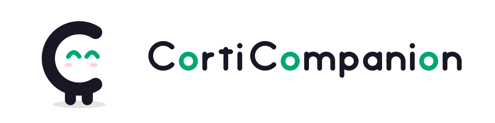
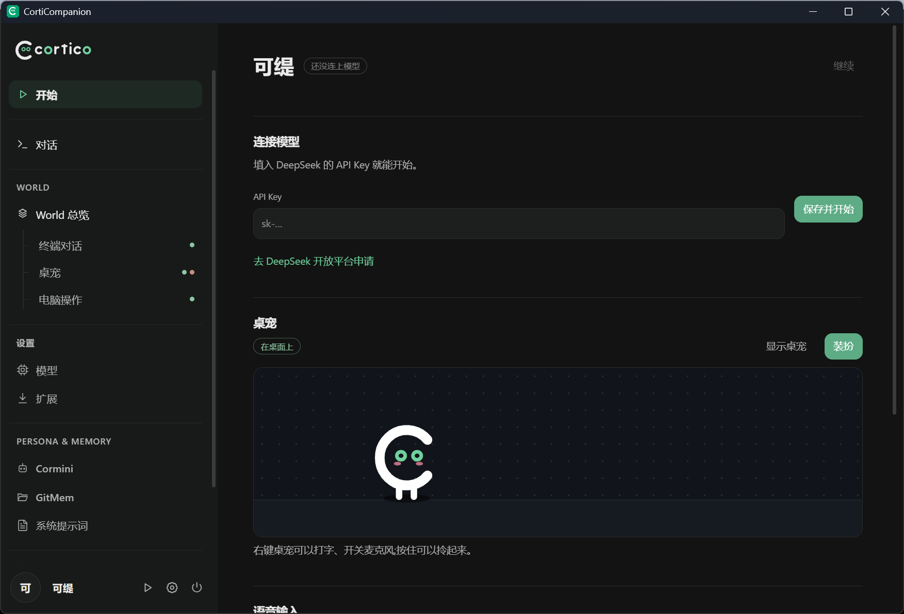

<p align="center">
  <picture>
    <source media="(prefers-color-scheme: dark)" srcset="assets/banner-dark.svg">
    
  </picture>
</p>

<p align="center"><b>你的小小万能桌面伴侣</b></p>

<p align="center">
  <a href="https://github.com/Pal-AI-Lab/Coopanion/releases/latest"></a>
  <a href="https://github.com/Pal-AI-Lab/Coopanion/actions/workflows/ci.yml"></a>
  
  <a href="LICENSE"></a>
</p>

<p align="center">
  <a href="#安装">安装</a> ·
  <a href="#快速上手">快速上手</a> ·
  <a href="#日常使用">日常使用</a> ·
  <a href="#常见问题">常见问题</a> ·
  <a href="docs/DEVELOPMENT.md">参与开发</a>
</p>

桌宠 **Coo** 住在你的屏幕底边。它会用气泡和你聊天、听你说话、在任务栏上走来走去,也能在你允许时帮你操作电脑。



## 它能做什么

- **陪你聊天**:按住左 Alt 说话,或者直接打字,Coo 在气泡里回你。
- **记得你**:会记住你们聊过的事,也知道你刚才戳了它、摸了它的头。
- **帮你动手**:让它帮你点按钮、打字、切窗口。每次动手前它都会先问你。
- **打扮它**:换配色、帽子、耳饰、眼镜、颈饰,调它的大小和走动习惯。
- **装新本事**:从扩展页装上 QQ 机器人、画室、小游戏等 World。

## 安装

需要 **Windows 10 / 11(64 位)**,还需要一个 [DeepSeek](https://platform.deepseek.com/) 账号(按用量付费,见[费用与隐私](#费用与隐私))。
安装不需要管理员权限。

### 方法一:下载安装包

1. 打开[最新发布](https://github.com/Pal-AI-Lab/Coopanion/releases/latest),下载 `CortiCompanion-Setup-版本号.exe`。
2. 双击运行。安装包没有数字签名,Windows 可能弹出「Windows 已保护你的电脑」:点 **更多信息** → **仍要运行**。
3. 选安装位置(默认 `C:\Users\你的用户名\CortiCompanion`),点安装。装好后会自动启动,桌面上会有它的图标。

> [!NOTE]
> 程序和它写下的所有文件都在安装目录里,AppData 里不放任何东西,所以开始菜单里没有它,从桌面图标打开。

### 方法二:一行命令

在开始菜单搜 **PowerShell**,打开后粘贴这一行,回车:

```powershell
irm https://raw.githubusercontent.com/Pal-AI-Lab/Coopanion/main/installer/install.ps1 | iex
```

它会下载最新的安装包并运行,效果和方法一相同,装完会删掉下载的安装包。

## 快速上手

1. **启动**:屏幕底边会出现 Coo,任务栏右下角多一个托盘图标。设置窗口不会自己弹出来。
2. **连接模型**:Coo 会冒气泡问你要不要去填 API Key,点「去填」。
   选「等会儿」也没关系,只要还没填,它过一阵会再问;你对它说话时也会提醒。
3. **跟着引导走**:设置窗口第一次打开时有一份四页的引导:
   1. 告诉 Coo 怎么称呼你、平时走动多少;
   2. 粘贴 DeepSeek 的 API Key,点「保存并连接」;
   3. 学会怎么和它相处;
   4. 知道关掉窗口后去哪找它。

   右上角的「跳过」随时可以跳过。之后在「开始」页右上角点「使用引导」能再看一遍。
4. **打个招呼**:按住 **左 Alt** 说「你好」,松开发送。Windows 第一次会问能不能用麦克风,选「允许」。

<details>
<summary><b>怎么拿到 DeepSeek 的 API Key?</b></summary>

1. 打开 [DeepSeek 开放平台](https://platform.deepseek.com/api_keys),注册并登录;
2. 在「充值」里充几块钱(按用量计费,能用很久);
3. 进入「API Keys」→「创建 API key」,复制那串 `sk-` 开头的字符,粘贴到引导或「开始」页里。

</details>

## 日常使用

### 和 Coo 说话

| 方式 | 怎么做 |
|---|---|
| 语音 | **按住左 Alt** 说话,松开就算一句。Coo 会歪头听,在虚线气泡里边听边显示听到的字(灰色部分还可能改)。 |
| 打字 | 鼠标停在 Coo 身上,点身旁的气泡按钮;或者双击 Coo。 |
| 麦克风按钮 | 鼠标停在 Coo 身上时,身旁的麦克风按钮能开关语音输入;正在听时**长按**它,这句话马上发出,不用等停顿。 |
| 回答提问 | Coo 有时会给几个选项:点一下,或者按键盘上的 1–3;都不合适就在最后一格自己写。 |

说话键、麦克风、收音方式(按住说 / 按一下开关 / 一直听)都在设置窗口的「语音输入」页里改。

### 和 Coo 互动

- **点一下**:戳戳它;**在它头上来回划**:摸头;**按住拖起来**:拎起来,还能甩出去。它会有反应,也会知道你做了什么。
- **右键**打开菜单:
  - 顶上是 Coo 的头像和退出按钮(点一下先问,再点才退出);
  - 中间可以开关语音输入,选行为模式(常走动 / 多待着 / 不乱动),切换黑白模式和音效;
  - 最下面是「装扮…」和「打开设置」。

### 让 Coo 操作电脑

电脑操作默认开着,但 Coo 每一轮要看屏幕或动鼠标键盘之前,都会冒气泡问你:

- 点「可以」它才动手;选「这次不行」,这一轮它就不动。
- 你一碰鼠标或键盘,它会先停下来等你。
- 登录、密码、付款这些步骤,它会交给你自己来。

不想让它碰电脑:打开设置窗口的[高级模式](#设置窗口),在左栏「电脑操作」页关掉。

### 托盘

程序一直在后台运行。关掉设置窗口不会退出;再双击桌面图标,只会把 Coo 叫回来。

右键任务栏右下角的托盘图标,可以打开设置、显示桌宠、设为开机自动启动、重新启动或退出。左键单击托盘图标直接打开设置。

## 设置窗口

点托盘图标,或者在 Coo 身上右键 →「打开设置」,都能打开设置窗口。默认是**普通模式**,只有关于桌宠的四页:

| 页面 | 能做什么 |
|---|---|
| 开始 | 连接模型、看 Coo 醒着没有、显示桌宠、重看引导。左栏底部是暂停 / 继续。 |
| 习惯 | 怎么称呼你、走动多少、颜色、大小、音效 |
| 装扮 | 配色、帽子、耳饰、眼镜、颈饰,改动立刻生效 |
| 语音输入 | 开关、识别引擎、说话键、麦克风、收音方式,还有电平条和听到的内容 |

左栏底部的「**高级模式**」会显示全部页面:对话记录、World、模型、扩展、记忆、系统提示词、电脑操作、运行诊断、用量与成本。
点「回到普通模式」可以收起。你选的模式会被记住。

### 换模型

默认用 DeepSeek 的 `deepseek-flash`。它能看截图,电脑操作需要这个能力。在高级模式的「模型」页里可以:

- 调整思考档位:不思考 / 快 / 标准 / 最深;
- 新建连接,选「OpenAI Responses Compatible」,接入其他兼容 Responses API 的服务;
- 在「用量与成本」页看花了多少钱。DeepSeek 的高峰和错峰价格已经按时段计入。

### 装扩展

高级模式的「扩展」页列出 npm 上带 `cortico-world` 关键字的 World,例如:

- QQ 机器人(`cortico-world-qq-better`)
- 画室与你画我猜(`cortico-world-canvas`)
- 植物大战僵尸(`cortico-world-pvz`)
- 杀戮尖塔(`cortico-world-sts-1`)

点安装,装好后点「重启进程」,再到「World 总览」里启用。重装应用不会丢扩展。

## 费用与隐私

- **费用**:CortiCompanion 本身免费。和 Coo 聊天要调用 DeepSeek 的模型,费用由 DeepSeek 按用量从你的账户扣,在「用量与成本」页能看到。
- **会发给模型服务的内容**:你说的话和打的字、你和 Coo 的互动,以及电脑操作时的屏幕截图。这些内容只发给你配置的模型服务(默认 DeepSeek)。
- **留在你电脑上的内容**:API Key、记忆、对话记录、设置、日志,全部存在安装目录的 `data` 文件夹里。
  语音识别在本机完成,不管用 Windows 自带的引擎还是 whisper.cpp,录音都不会上传,发出去的只有识别出来的文字。
- **其他联网**:只在你安装扩展(从 npm 下载)或选用 whisper.cpp(下载识别程序和模型)时才会联网。

## 数据与卸载

所有数据都在安装目录的 `data` 文件夹里:

| 内容 | 位置(相对安装目录) |
|---|---|
| Coo 的记忆、对话记录、设置、API Key | `data\home` |
| 安装的扩展 | `data\extensions` |
| 运行日志 | `data\logs` |
| whisper.cpp 识别程序与模型(选用时才下载) | `data\home\runtimes`、`models` |
| 临时文件、扩展安装缓存、窗口缓存 | `data\tmp`、`data\pnpm`,以及 `data` 下的其余文件夹 |

**卸载**:在 Windows「设置 → 应用」里找到 CortiCompanion 卸载。`data` 文件夹会保留,重装后记忆和设置还在;彻底不要了,就手动删掉整个安装目录。

<details>
<summary>从 0.1.0 升级</summary>

第一次启动新版时,会把 `%APPDATA%\CortiCompanion` 里的记忆、设置和日志搬进 `data`,再删掉旧目录。
旧版装过的扩展,要在「扩展」页重新安装一次。

</details>

## 常见问题

<details>
<summary><b>桌宠不见了</b></summary>

右键托盘图标 →「显示桌宠」。托盘图标被折叠时,点任务栏右下角的 `^` 找到它。也可以再双击一次桌面图标。

</details>

<details>
<summary><b>Coo 不说话 / 没反应</b></summary>

打开设置窗口的「开始」页,看标题旁的状态:

- **还没连上模型**:检查 API Key 是否完整、DeepSeek 账户里还有没有余额,再点「测试连接」。
- **暂停中**:点左栏底部的「继续」。

</details>

<details>
<summary><b>它听不到我说话</b></summary>

- 鼠标停在 Coo 身上,确认身旁的麦克风按钮没有被划掉;
- 说话时按住了说话键(默认左 Alt);
- 「语音输入」页的识别服务显示就绪。你说话时电平条会跳,说明麦克风选对了;
- Windows 设置 → 隐私和安全性 → 麦克风里,允许了桌面应用使用麦克风。

识别服务报「没有语音识别器」时,到 Windows 设置 → 时间和语言 → 语言,给中文装上「语音识别」;或者在「语音输入」页换成 whisper.cpp。

</details>

<details>
<summary><b>语音识别不够准</b></summary>

在「语音输入」页把识别引擎换成 whisper.cpp,点「下载并启动」。它会下载识别程序和中文模型(约 190 MB,只下载一次)。
通过代理联网的电脑会沿用 `HTTPS_PROXY` / `HTTP_PROXY` 环境变量;本地识别服务始终直接连接。

</details>

<details>
<summary><b>想知道它在想什么</b></summary>

打开高级模式,「对话」页有完整的时间线。遇到问题时,在「运行诊断」页导出诊断包,附在 [Issue](https://github.com/Pal-AI-Lab/Coopanion/issues) 里。

</details>

## 反馈与参与

- 遇到问题或有想法:提一个 [Issue](https://github.com/Pal-AI-Lab/Coopanion/issues),写清楚 Windows 版本、CortiCompanion 版本和复现步骤。
- 想从源码构建或改代码:看 [开发文档](docs/DEVELOPMENT.md)。

## 致谢

CortiCompanion 由 [Cortico](https://github.com/Pal-AI-Lab/Cortico) 组装而成:Cortico Core + Cormini Persona +
[桌宠 World](https://github.com/Phantivia/cortico-world-desktop-pet) + [电脑操作 World](https://github.com/Phantivia/cortico-world-cua)。

## 许可

[MIT](LICENSE)。随附或运行时下载的第三方组件:Electron(MIT)、Cortico(MIT)、whisper.cpp 与其 ggml 模型(MIT,选用时下载)、koffi(MIT)、jpeg-js(BSD-3-Clause)、pnpm(MIT)。
