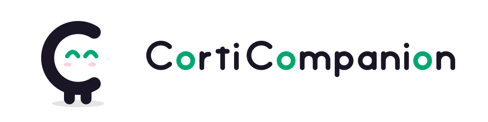
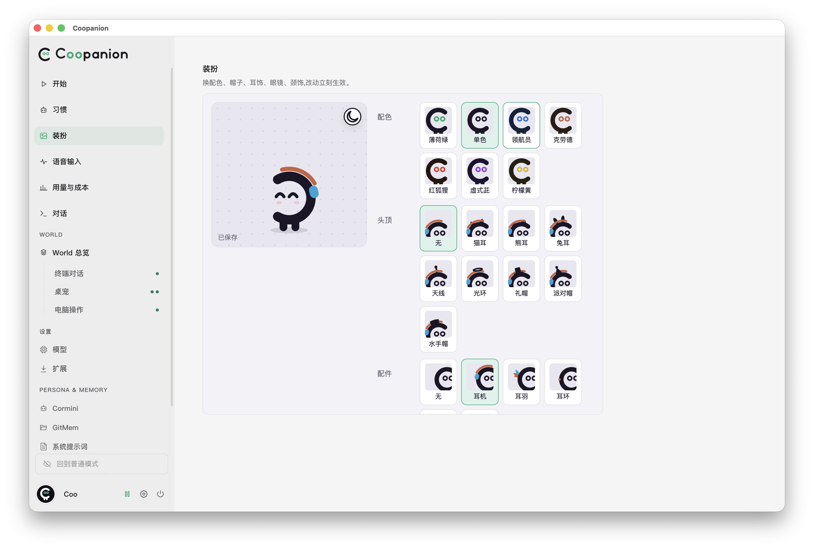

<p align="center">
  <picture>
    <source media="(prefers-color-scheme: dark)" srcset="assets/banner-dark.svg">
    
  </picture>
</p>

<p align="center"><b>你的小小万能桌面伴侣</b></p>

<p align="center">
  <a href="https://github.com/Pal-AI-Lab/Coopanion/releases/latest"></a>
  <a href="https://github.com/Pal-AI-Lab/Coopanion/actions/workflows/ci.yml"></a>
  
  
  
  <a href="LICENSE"></a>
</p>

<p align="center">
  <a href="#安装">安装</a> ·
  <a href="#快速上手">快速上手</a> ·
  <a href="#日常使用">日常使用</a> ·
  <a href="#常见问题">常见问题</a> ·
  <a href="docs/DEVELOPMENT.md">参与开发</a>
</p>

桌宠 **Coo** 住在你的屏幕底边。它会用气泡和你聊天、听你说话、在屏幕底边走来走去,也能在你允许时帮你操作电脑。Windows、macOS 和 Linux 都能用



## v0.1.12 更新:电脑操作进普通模式,清空重开,大肥鱼的主题色

- **「电脑操作」页进普通模式**:设置窗口左栏「语音输入」下面多了「电脑操作」页,能开关电脑操作、允许或禁止动鼠标键盘、选「什么时候先问你」的四档,选「问一次」时还能改「同意管多久」。不用再开高级模式。
- **清空重开**:「系统提示词」页「重载当前 session」旁边多了「清空重开」按钮。确认后 Coo 忘掉这段对话的上下文,按现在的系统提示词从头开始;工作区里的记忆和人设都保留。改完人设想让它从头按新设定来,就点这个。
- **大肥鱼的主题色**:装扮页换成大肥鱼的某套配色时,设置窗口跟着换成同色系的主题色,包括按钮、选中项、图表和装扮页里的选中框;换回 Coo 回到原来的绿色。在高级模式「设置」页的「外观」里自己选过别的配色方案的话,保持你的选择。
- **等待不再先问你**:Coo 操作电脑时等界面加载的那一步不再弹气泡问你。「每轮都问」档下这一轮你还没同意时,它只等不截图。

完整说明见 [docs/releases/v0.1.12.md](docs/releases/v0.1.12.md)。

## v0.1.11 更新:记住位置,多显示器,出错时 Coo 会说原因

- **记住位置**:「习惯」页勾上「记住位置」后,下次启动 Coo 落回上次退出时的横向位置。默认关闭;多块屏幕时启动总在主屏。
- **多显示器**:拎着 Coo 拖到另一块屏幕上松手,桌宠窗口跟过去。
- **「对话」页进普通模式**:设置窗口左栏「用量与成本」下面就是,能看到 Coo 当前这段对话的记录,也能在这里和它说话。
- **操作电脑不容易被中途打断**:每次唤醒最多请求模型的次数放宽到 40 次,可在高级模式的 Cormini 页改。
- **修复**:Windows 上鼠标停在 Coo 身上时浏览器视频不再停住;模型连续请求失败时 Coo 会在气泡里说出原因;大肥鱼不会再整只消失;开麦失败时麦克风会关掉;人设里写的「可缇」不会在启动时被改成 Coo。
- **许可证**:从这个版本起改用 AGPL-3.0-or-later,之前发布的版本仍按 MIT。

完整说明见 [docs/releases/v0.1.11.md](docs/releases/v0.1.11.md)。

## v0.1.10 更新:匿名使用统计,大肥鱼的嘴

- **匿名使用统计**:Coopanion 会向项目服务器发送不含对话内容的使用次数、时长和设置,帮我们知道有多少人在用、哪些功能有人用。发送的全部字段见 [docs/TELEMETRY.md](docs/TELEMETRY.md)。不想发送,在「习惯」页最下面取消勾选「匿名使用统计」。
- **启动引导多一问**:Coo 会问「你是从哪里认识我的?」,点一个回答,也可以选「不告诉你」跳过。
- **大肥鱼的嘴位置修正**:开心、被拎起、害羞、睡觉、打哈欠和说话时,嘴比平时高出一截,现在都落回原位;说话时嘴以中线为轴张开。

## v0.1.9 更新:人设放到普通模式,更新提醒

- **系统提示词进普通模式**:设置窗口普通模式的左栏多了「系统提示词」页,不用开高级模式就能看到并修改 Coo 的人设(「CONSTITUTION」一段)和整份提示词。
- **引导之后商量设定**:启动引导最后一步会告诉你人设写在哪里。走完引导后 Coo 会收到一条提示,知道可以和你商量它的性格、说话方式和称呼,商量好的人设它能自己改,也会带你去提示词页。
- **更新提醒和项目地址**:设置窗口左上角字标下显示当前版本,点它打开 GitHub 项目主页。GitHub 上有更新的正式版本时,下面多一行「Coopanion x.y.z 已发布」,点它去下载。
- **控制台同步 Cortico 最新界面**:扩展页和模型编辑页换成新版设计,「获取模型列表」后显示数量与选单,列表项带显示名、最大输出与能否看图;计价段的扩展计量去掉了 `detail:` 前缀。

## v0.1.8 更新:电脑操作的询问分档

- **什么时候先问你**:原来 Coo 每一轮看屏幕或动鼠标键盘前都要问一次。现在高级模式「电脑操作」页多了一项「什么时候先问你」,从严到松四档:`ask-each-turn` 每轮都问(默认,和原来一样);`ask-before-acting` 看屏幕不问,动鼠标键盘前每轮问;`ask-once` 看屏幕不问,动手前问一次,同意后 30 分钟(可调)内不再问;`never-ask` 都不问。改了立即生效。

## v0.1.7 更新:Linux 支持

- **Linux(x64)**:新增 `.deb` 和 `.AppImage` 安装包,见下面[安装](#linux)。桌宠、设置窗口、说话键、FunASR 本地识别、让 Coo 操作电脑都能用;需要 X11 桌面,Wayland 会话下通过 XWayland 运行。
- **大肥鱼重新分层**:全部部件按「每个部件是一张完整的画」重画了一遍,边缘不再带被遮挡处的切口、锯齿和虚点。脸型照原画收窄,尾巴重画成顺滑的弧线;下巴两侧的卷发、垂在身前的两束长发、左下的回卷、后腰蝴蝶结拆成单独的层,放回原画里它们该在的前后位置。
- **眉毛和上眼皮**:新增眉毛(隔着刘海也能看到)和双眼皮褶线;眉毛随表情抬起、压低或挑起眉头,褶线跟着眼睛睁闭。惊讶、爱心眼补上了完整眼白。八套配色同步更新。

## v0.1.6 更新:DeepSeek 大肥鱼

桌宠多了一个形象:**DeepSeek 大肥鱼**,一只 Q 版鲸鱼女仆。打开设置窗口的「装扮」页,最上面一行「形象」里选「DeepSeek 大肥鱼」,屏幕底边的桌宠立刻换成她;选「Coo」换回来。

- **全动态**:她是分件做成的 Live2D 式模型,走、跑、跳、坐下、睡觉、被鼠标拎起来甩、转身、眨眼、跟着鼠标看,十几种表情都有;头发、裙摆、尾巴、鲸鱼鳍和呆毛会跟着动作晃。倾听、点头、打瞌睡时是低头歪头,脚不离地。
- **八套配色**:DeepSeek(原版)、DeepSeek Harness(纯黑)、ChatGPT、Claude、Gemini、千问、Kimi、MiniMax,每套换成对应厂商标志的配色,围裙上印着那家的标志。在「装扮」页选了大肥鱼以后,下面一行就是配色,点一下渐变过去。
- Coo 原来的配色和配件都还在,换回 Coo 时照旧。

## 它能做什么

- **换哪家模型都行**:DeepSeek、通义千问、Kimi、智谱 GLM、豆包、百度千帆、MiniMax、阶跃星辰、OpenRouter,点一下标志、贴上 Key 就能用。
- **陪你聊天**:快速按一下左 Alt(Mac 是左 Option)、紧接着按住说话,或者直接打字,Coo 在气泡里回你。语音用 FunASR 在你电脑上识别。
- **记得你**:会记住你们聊过的事,也知道你刚才戳了它、摸了它的头。
- **帮你动手**:让它帮你点按钮、打字、切窗口。每次动手前它都会先问你。
- **换个形象**:除了 Coo,还可以换成 **DeepSeek 大肥鱼**:Live2D 式全动态的鲸鱼女仆,八套厂商主题配色。
- **打扮它**:换配色、帽子、耳饰、眼镜、颈饰,调它的大小和走动习惯。
- **装新本事**:从扩展页装上 QQ 机器人、画室、小游戏等 World。

## 安装

需要 **Windows 10 / 11(64 位)**、**macOS 13 以上**(Apple 芯片和 Intel 都行)或 **64 位 Linux 桌面**(X11,或 Wayland 下的 XWayland),还需要一家模型服务的 API Key(默认推荐 [DeepSeek](https://platform.deepseek.com/),按用量付费,见[费用与隐私](#费用与隐私))。
安装不需要管理员权限。

### Windows:下载安装包

1. 打开[最新发布](https://github.com/Pal-AI-Lab/Coopanion/releases/latest),下载 `Coopanion-Setup-版本号.exe`。
2. 双击运行。安装包没有数字签名,Windows 可能弹出「Windows 已保护你的电脑」:点 **更多信息** → **仍要运行**。
3. 选安装位置(默认 `C:\Users\你的用户名\Coopanion`),点安装。装好后会自动启动,桌面上会有它的图标。

> [!NOTE]
> 程序和它写下的所有文件都在安装目录里,AppData 里不放任何东西,所以开始菜单里没有它,从桌面图标打开。

### Windows:一行命令

在开始菜单搜 **PowerShell**,打开后粘贴这一行,回车:

```powershell
irm https://raw.githubusercontent.com/Pal-AI-Lab/Coopanion/main/installer/install.ps1 | iex
```

它会下载最新的安装包并运行,效果和上面相同,装完会删掉下载的安装包。

### macOS

1. 打开[最新发布](https://github.com/Pal-AI-Lab/Coopanion/releases/latest),Apple 芯片的 Mac 下载 `Coopanion-版本号-mac-arm64.dmg`,Intel 的下载 `…-mac-x64.dmg`。
   不确定是哪种:点左上角苹果菜单 →「关于本机」,「芯片」一栏写着 Apple M 系列就是 Apple 芯片。
2. 双击 dmg,把 Coopanion 拖进「应用程序」。
3. 第一次打开:应用没有 Apple 开发者签名,系统会拦下。先双击打开一次,看到提示后点「完成」;
   再到「系统设置 → 隐私与安全性」,页面底部有一行说 Coopanion 被阻止,点「仍要打开」,输入密码确认。之后就能正常打开。
4. 它住在屏幕顶部的**菜单栏**里,程序坞里没有它的图标(打开设置窗口时才出现)。

> [!NOTE]
> Mac 上的数据在 `~/Library/Application Support/Coopanion`。第一次用到时,系统会分别询问:
> 麦克风(语音输入)、输入监控(说话键)、录屏与系统录音和辅助功能(让 Coo 操作电脑)。
> 不想让它碰电脑,后两项不给就行。改了「输入监控」「辅助功能」「录屏」之后要重启 Coopanion 才生效。

### Linux

1. 打开[最新发布](https://github.com/Pal-AI-Lab/Coopanion/releases/latest),下载 `Coopanion-版本号-linux-x64.deb`(Debian / Ubuntu)或 `Coopanion-版本号-linux-x64.AppImage`(其他发行版)。
2. deb:`sudo apt install ./Coopanion-版本号-linux-x64.deb`,装好后在应用菜单里打开 Coopanion。
   AppImage:`chmod +x Coopanion-*.AppImage` 后双击或在终端运行;Ubuntu 22.04 以后要先装 `libfuse2`(`sudo apt install libfuse2t64`)。
3. 桌宠是一个透明、置顶的窗口,需要桌面有窗口合成(GNOME、KDE 等默认都有)。Wayland 会话下它通过 XWayland 运行。

> [!NOTE]
> Linux 上的数据在 `~/.config/Coopanion`。托盘图标需要桌面支持状态栏图标(GNOME 要装 AppIndicator 扩展);没有托盘时,右键 Coo 打开菜单就能进设置。
> 让 Coo 操作电脑要用到 `xdotool`(打字、切窗口)和 `zenity`(问你能不能用电脑),deb 会自动装上;Wayland 会话下截屏还需要 `grim`、`spectacle`、`scrot` 或 ImageMagick 之一。

## 快速上手

1. **启动**:Coo 从屏幕顶上掉到底边,任务栏右下角(Mac 是屏幕顶部菜单栏,Linux 是桌面的状态栏)多一个图标。不会弹出任何窗口。
2. **跟着引导走**:第一次启动时,Coo 就在屏幕底边冒气泡和你对话,答案直接在气泡里点选或填写:

   1. 打个招呼,问你怎么称呼;
   2. 问你希望它安静还是活泼:点「不乱动 / 多待着 / 常走动」三张卡片,它马上站着不动、溜达起来或者跑来跑去给你看;
   3. 问你用哪家模型服务:气泡里是一排带标志的卡片,DeepSeek 排第一,拿不准就选它;再把那一家的 API Key 贴进气泡里的输入框,当场连一下,连上了它会高兴地跳起来;
   4. 一键下载语音识别模型(FunASR,约 230 MB,从国内的 ModelScope 下载,气泡里有进度条),再教你怎么和它说话;
   5. 告诉你按钮、菜单和设置在哪,还有它的人设写在设置窗口的「系统提示词」页里,想让它换个样子可以去改。

   走完引导后 Coo 会知道这件事,可以接着和你商量它的性格、说话方式和你们之间的称呼。商量好的人设它能自己写进提示词;你想自己动手,就去「系统提示词」页。

   气泡右上角的 × 随时可以结束引导。之后在设置窗口「开始」页右上角点「使用引导」,Coo 会在屏幕底边再带你走一遍。
   引导里选了「稍后再填」Key 也没关系:只要还没填,它过一阵会在气泡里再问你要;你对它说话时也会提醒。
3. **打个招呼**:快速按一下**左 Alt**(Mac 是**左 Option**),紧接着按住它说「你好」,松开发送。第一下按完 Coo 会先抬头看你,按住时它就开始听。第一次系统会问能不能用麦克风,选「允许」。

<details>
<summary><b>怎么拿到 API Key?</b></summary>

以 DeepSeek 为例:

1. 打开 [DeepSeek 开放平台](https://platform.deepseek.com/api_keys),注册并登录;
2. 在「充值」里充值(按用量计费,注意 token 消耗);
3. 进入「API Keys」→「创建 API key」,复制那串 `sk-` 开头的字符,贴进 Coo 的气泡或「开始」页里。

别家的申请页,在气泡或「开始」页选中那一家后点「去 … 申请」就能打开:

| 服务                 | 申请 Key                                                                                          | 默认模型                                                                    |
| -------------------- | ------------------------------------------------------------------------------------------------- | --------------------------------------------------------------------------- |
| DeepSeek             | [platform.deepseek.com](https://platform.deepseek.com/api_keys)                                    | `deepseek-flash`                                                          |
| 通义千问(阿里云百炼) | [bailian.console.aliyun.com](https://bailian.console.aliyun.com/cn-beijing/model/settings/api-key) | `qwen3.8-flash`                                                           |
| Kimi(月之暗面)       | [platform.kimi.com](https://platform.kimi.com/console/api-keys)                                    | `kimi-k3`                                                                 |
| 智谱 GLM             | [bigmodel.cn](https://bigmodel.cn/usercenter/proj-mgmt/apikeys)                                    | `glm-5.3-flash`(智谱的 Responses 文档只示范了 `glm-5.3`,连不上就换成它) |
| 豆包(火山方舟)       | [ark.volcengine.com](https://ark.volcengine.com/region:cn-beijing/apikey)                          | `doubao-seed-2-1-lite-260915`(要先在方舟控制台「开通管理」里开通这个模型) |
| 百度千帆             | [console.bce.baidu.com](https://console.bce.baidu.com/iam/#/iam/apikey/list)                       | `glm-5.1`(千帆的 Responses 接口没有文心模型,也没有能看图的)               |
| MiniMax              | [platform.minimax.cn](https://platform.minimax.cn/user-center/basic-information/interface-key)     | `MiniMax-M3`                                                              |
| 阶跃星辰             | [platform.stepfun.com](https://platform.stepfun.com/interface-key)                                 | `step-3.7-flash`                                                          |
| OpenRouter           | [openrouter.ai](https://openrouter.ai/settings/keys)                                               | `deepseek/deepseek-v4.1-flash`                                            |

默认模型是每家最新一代里便宜、能看图的那档(千帆没有这样的模型)。想用别的,在引导里选完服务后把模型名改掉,或者在「开始」页的「模型」框里填,输入时会列出几个推荐的。

DeepSeek 以外的几家是按各自文档接入的,还没拿真实的 Key 逐家试过;哪家连不上或回话出错,欢迎开 issue。

</details>

## 日常使用

### 和 Coo 说话

| 方式       | 怎么做                                                                                                                                              |
| ---------- | --------------------------------------------------------------------------------------------------------------------------------------------------- |
| 语音       | **快速按一下左 Alt、紧接着按住**(Mac 是左 Option)说话,松开就算一句。Coo 会歪头听,在虚线气泡里边听边显示听到的字(灰色部分还可能改)。           |
| 打字       | 鼠标停在 Coo 身上,点身旁的气泡按钮;或者双击 Coo。                                                                                                   |
| 麦克风按钮 | 鼠标停在 Coo 身上时,身旁的麦克风按钮能开关语音输入(角上的 KEY / AUTO 表示按键收音还是一直在听);正在听时**长按**它,这句话马上发出,不用等停顿。 |
| 回答提问   | Coo 有时会给几个选项:点一下,或者按键盘上的 1–3;都不合适就在最后一格自己写。                                                                        |

说话键暂时不可用时会退回自动收音，按钮显示 AUTO，悬停提示会说明原因；按住说话或按一下开关时显示 KEY。

说话键、麦克风、收音方式(按住说 / 按一下开关 / 一直听)都在设置窗口的「语音输入」页里改。说话键可以是单个键、组合键(比如 `Ctrl + Space`),也可以是连按:在「说话键」按钮上点一下,再把想要的键连按两下,就设成「快速按一下再按住」。

语音默认用 **FunASR**(阿里巴巴通义实验室的 SenseVoiceSmall 模型)在你自己的电脑上识别,中文准,录音不上传。
模型约 230 MB,第一次用时在引导的气泡里或「语音输入」页点一下「下载」就行,从 ModelScope 下载(国内直连),下完就一直能用。
Windows 上也可以换成系统自带的识别,不用下载,但没那么准。

### 和 Coo 互动

- **点一下**:戳戳它;**在它头上来回划**:摸头;**按住拖起来**:拎起来,还能甩出去。它都会有反应,也会知道你做了什么。
  戳它会让它开口回应;摸头和拎起来不会单独叫它想事情,等下次你戳它、和它说话时一起告诉它。想让每种互动都叫醒它,在高级模式桌宠 World 的「哪些互动单独唤醒」里选 `all`。
- **记住位置**:默认关闭。在设置窗口「习惯」页勾上「记住位置」后,退出应用时记下 Coo 在屏幕上的横向位置,下次启动落回那里。接了多块屏幕时只记横向的比例,启动时 Coo 总在主屏上。
- **右键**打开菜单,全是圆形图标按钮,鼠标停上去有说明:
  - 上面一排是 Coo 的头像和名字,然后是继续 / 暂停、打开设置、退出(点一下先问,再点才退出);
  - 下面是各项功能:打字、语音输入(开 / 关,角上标着 KEY 或 AUTO)、行为模式(仪表盘图标,低 · 中 · 高三档轮换)、
    夜间模式(月亮 / 太阳)、音效(开 / 静音)、装扮(小衣服,鼠标停上去会变色)、隐藏。开着的开关会亮起来。
- **悬停按钮**:鼠标停在 Coo 身上,旁边默认出现「打字」「语音」两个按钮。想换成别的、最多放六个,在设置窗口「习惯」页的「悬停按钮」里点选。
- **多块显示器**:Coo 一次只在一块屏幕上,启动时在主屏幕。把它拎到另一块屏幕上松手,它就落到那块屏幕的底边;自己走路不会走出当前这块屏幕。那块屏幕被拔掉时,它回到主屏幕。

### 让 Coo 操作电脑

电脑操作默认开着,但 Coo 每一轮要看屏幕或动鼠标键盘之前,都会冒气泡问你:

- 点「可以」它才动手;选「这次不行」,这一轮它就不动。
- 嫌问得多,在设置窗口左栏「电脑操作」页的「什么时候先问你」里放宽,从严到松四档:
  `ask-each-turn` 每轮都问(默认);`ask-before-acting` 看屏幕不问,动鼠标键盘前每轮问;
  `ask-once` 看屏幕不问,动手前问一次,同意后「同意管多久」(默认 30 分钟)内不再问;`never-ask` 都不问。
- 一次唤醒里 Coo 最多请求模型 40 次,到第 20 次会提醒它做完手上的事就收尾;到了上限这一轮就结束,要它接着做,再跟它说一声。
  「同意管多久」只管要不要再问你,不改这个次数。次数在高级模式左栏「Cormini」页的「单次唤醒上限」「收尾提醒」里改,重启 Coopanion 后生效。
- 你一碰鼠标或键盘,它会先停下来等你。
- 登录、密码、付款这些步骤,它会交给你自己来。

不想让它碰电脑:在设置窗口左栏「电脑操作」页取消勾选「让 Coo 操作这台电脑」。

### 托盘 / 菜单栏

程序一直在后台运行。关掉设置窗口不会退出;再打开一次程序(Windows 双击桌面图标,Mac 在「应用程序」里打开),只会把 Coo 叫回来。

Windows:右键任务栏右下角的托盘图标,可以打开设置、显示桌宠、设为开机自动启动、重新启动或退出;左键单击直接打开设置。
Mac:点屏幕顶部菜单栏里 Coo 的图标,是同一份菜单。
Linux:状态栏里 Coo 的图标是同一份菜单,开机自动启动会写进 `~/.config/autostart`。

## 设置窗口

点托盘(菜单栏)图标,或者在 Coo 身上右键点齿轮,都能打开设置窗口。默认是**普通模式**,只有关于桌宠的几页:

| 页面       | 能做什么                                                                                            |
| ---------- | --------------------------------------------------------------------------------------------------- |
| 开始       | 连接模型、看 Coo 醒着没有、显示桌宠、重看引导。左栏底部是暂停 / 继续。                              |
| 习惯       | 怎么称呼你、走动多少、颜色、大小(拖动时 Coo 跟着变)、音效、记住位置、悬停按钮                       |
| 装扮       | 形象(Coo 或 DeepSeek 大肥鱼);Coo 的配色、帽子、耳饰、眼镜、颈饰,大肥鱼的八套配色。改动立刻生效;选大肥鱼时设置窗口换成那套配色的主题色 |
| 语音输入   | 开关、识别引擎、识别模型下载、说话键、麦克风、收音方式,还有电平条和听到的内容                      |
| 电脑操作   | 开关电脑操作、允许动鼠标键盘、什么时候先问你、同意管多久                                            |
| 系统提示词 | Coo 的整份系统提示词,人设在「CONSTITUTION」一段。改完按 Ctrl+S 保存,点「重载当前 session」生效;「清空重开」让 Coo 忘掉这段对话、从头开始 |
| 用量与成本 | 每天用了多少 token、花了多少钱                                                                      |
| 对话       | 当前这段对话的记录:你打字、说话、戳它时它收到的消息,它的思考和动作(说出的话在 `pet_say` 里)。上下文太长时 Coo 会整理成一份笔记重新开始,之前的内容不再显示。下面的输入框也能直接和 Coo 说话 |

左上角字标下面是当前版本,点它打开 GitHub 上的项目主页;有新版本发布时,下面会多一行「Coopanion x.y.z 已发布」,点它去下载。

左栏底部的「**高级模式**」会显示全部页面:World、模型、扩展、记忆、电脑操作、运行诊断。
点「回到普通模式」可以收起。你选的模式会被记住。

### 换模型

「开始」页的「连接模型」一栏列着 Coo 支持的几家服务,点一家、填好模型名(默认已填好)、贴上它的 Key,就换过去了。每家各存一份 Key,换回来不用重填;只改正在用的这家的模型时 Key 可以留空。
默认用 DeepSeek 的 `deepseek-flash`。它能看截图,电脑操作需要这个能力;除百度千帆外,各家的默认模型都能看图。在高级模式的「模型」页里可以:

- 换模型、调整思考档位:不思考 / 快 / 标准 / 最深(各家接受的档位不同,会自动换成那一家支持的值);
- 新建连接,选「OpenAI Responses Compatible」,接入其他兼容 Responses API 的服务;
- 在「用量与成本」页看花了多少钱。DeepSeek 的高峰和错峰价格已经按时段计入;别家没有内置价目,可以在「模型」页的价目里自己填。

### 装扩展

高级模式的「扩展」页列出 npm 上带 `cortico-world` 关键字的 World,例如:

- QQ 机器人(`cortico-world-qq-better`)
- 画室与你画我猜(`cortico-world-canvas`)
- 植物大战僵尸(`cortico-world-pvz`)
- 杀戮尖塔(`cortico-world-sts-1`)

点安装,装好后点「重启进程」,再到「World 总览」里启用。重装应用不会丢扩展。

## 费用与隐私

- **费用**:Coopanion 本身免费。和 Coo 聊天要调用你选的模型服务,费用由那一家按用量从你的账户扣,在「用量与成本」页能看到(内置价目的只有 DeepSeek)。
- **会发给模型服务的内容**:你说的话和打的字、你和 Coo 的互动,以及电脑操作时的屏幕截图。这些内容只发给你配置的模型服务(默认 DeepSeek)。
- **留在你电脑上的内容**:API Key、记忆、对话记录、设置、日志,全部存在数据文件夹里(Windows 在安装目录的 `data`,Mac 在 `~/Library/Application Support/Coopanion`,Linux 在 `~/.config/Coopanion`)。
  语音识别在本机完成,不管用 FunASR 还是 Windows 自带的引擎,录音都不会上传,发出去的只有识别出来的文字。
- **匿名使用统计**:发给项目服务器 `survey.palailab.org`,只有使用次数、时长、设置和随机生成的安装编号,不含对话、截图、Key 和文件。全部字段见 [docs/TELEMETRY.md](docs/TELEMETRY.md),在「习惯」页可以关掉。
- **其他联网**:打开设置窗口时向 GitHub 查一次有没有新版本;安装扩展(从 npm 下载)或下载语音识别模型(从 ModelScope,取不到时从 Hugging Face)时也会联网。

## 数据与卸载

Windows 上所有数据都在安装目录的 `data` 文件夹里:

| 内容                                | 位置(相对安装目录)                                       |
| ----------------------------------- | -------------------------------------------------------- |
| Coo 的记忆、对话记录、设置、API Key | `data\home`                                            |
| 安装的扩展                          | `data\extensions`                                      |
| 运行日志                            | `data\logs`                                            |
| 语音识别模型(FunASR,下载后才有)     | `data\home\models`                                     |
| 临时文件、扩展安装缓存、窗口缓存    | `data\tmp`、`data\pnpm`,以及 `data` 下的其余文件夹 |

**卸载**:在 Windows「设置 → 应用」里找到 Coopanion 卸载。`data` 文件夹会保留,重装后记忆和设置还在;彻底不要了,就手动删掉整个安装目录。

Mac 上数据在 `~/Library/Application Support/Coopanion`,里面的分法同上。卸载时把「应用程序」里的 Coopanion 拖进废纸篓;
彻底不要了,再删掉这个文件夹。

Linux 上数据在 `~/.config/Coopanion`,分法同上。deb 用 `sudo apt remove coopanion` 卸载,AppImage 直接删掉文件;彻底不要了,再删掉这个文件夹。

## 常见问题

<details>
<summary><b>桌宠不见了</b></summary>

右键托盘图标 →「显示桌宠」。托盘图标被折叠时,点任务栏右下角的 `^` 找到它。也可以再双击一次桌面图标。
Mac 上点菜单栏里 Coo 的图标 →「显示桌宠」,或者在「应用程序」里再打开一次。

</details>

<details>
<summary><b>Coo 不说话 / 没反应</b></summary>

打开设置窗口的「开始」页,看标题旁的状态:

- **还没连上模型**:检查 API Key 是否完整、那一家账户里还有没有余额,再点「测试连接」。豆包要先在方舟控制台开通默认模型。
- **暂停中**:点左栏底部的「继续」。

填了 Key 但模型请求连着失败 5 次时,Coo 会在气泡里说出模型服务返回的错误(比如模型名不存在、Key 无效、余额不足),点「打开设置」到「开始」页改模型名或 Key,再点「测试连接」。

</details>

<details>
<summary><b>它听不到我说话</b></summary>

- 鼠标停在 Coo 身上,确认身旁的麦克风按钮没有被划掉;
- 说话时先快速按一下左 Alt、再按住它(默认说话键;按一下太慢或两下隔太久都不算);
- 「语音输入」页的识别服务显示就绪;显示「识别模型还没下载」就点「下载」。你说话时电平条会跳,说明麦克风选对了;
- Windows 设置 → 隐私和安全性 → 麦克风里,允许了桌面应用使用麦克风;
- Mac:「系统设置 → 隐私与安全性」里,「麦克风」和「输入监控」都打开了 Coopanion(改完重启它)。

用 Windows 自带引擎时报「没有语音识别器」,到 Windows 设置 → 时间和语言 → 语言,给中文装上「语音识别」;或者换回 FunASR。

</details>

<details>
<summary><b>语音识别不够准</b></summary>

确认「语音输入」页的识别引擎是 FunASR(Windows 自带的引擎没那么准)。说话时离麦克风近一点,一句话说完停一下再松开说话键。

</details>

<details>
<summary><b>想知道它在想什么</b></summary>

左栏的「对话」页有完整的时间线。遇到问题时,在这一页点「导出诊断」,把下载的诊断包附在 [Issue](https://github.com/Pal-AI-Lab/Coopanion/issues) 里。

</details>

## 反馈与参与

- 遇到问题或有想法:提一个 [Issue](https://github.com/Pal-AI-Lab/Coopanion/issues),写清楚系统版本(Windows、macOS 或 Linux 发行版)、Coopanion 版本和复现步骤。
- 想从源码构建或改代码:看 [开发文档](docs/DEVELOPMENT.md)。

## 致谢

Coopanion 由 [Cortico](https://github.com/Pal-AI-Lab/Cortico) 组装而成:Cortico Core + Cormini Persona +
[桌宠 World](packages/cortico-world-desktop-pet) + [电脑操作 World](packages/cortico-world-cua)。

## 许可

[AGPL-3.0-or-later](LICENSE)。0.1.10 及之前发布的版本是 MIT,已经发出的仍按 MIT。框架 Cortico 是 MIT,以子模块随附,许可各归各。想提 PR 见 [CONTRIBUTING.md](CONTRIBUTING.md),第一次提交要签一份[贡献者许可协议](CLA.md)。

DeepSeek 大肥鱼形象(`packages/cortico-world-desktop-pet/web/whale/` 的贴图)不在 AGPL 授权范围内,来源与各家标志的说明见[桌宠 World 的第三方声明](packages/cortico-world-desktop-pet/THIRD_PARTY_NOTICES.md)。随附或运行时下载的第三方组件:Electron(MIT)、Cortico(MIT)、sherpa-onnx(Apache-2.0)、FunASR 的 SenseVoiceSmall 模型([FunASR 模型开源协议](https://github.com/modelscope/FunASR/blob/main/MODEL_LICENSE),用时下载)、koffi(MIT)、jpeg-js(BSD-3-Clause)、pnpm(MIT)、各家模型服务的标志取自 [lobe-icons](https://github.com/lobehub/lobe-icons)(MIT;标志本身归各自的公司所有,只用来标明是哪一家服务)。

装扮编辑器会跟随控制台的明暗主题和强调色，桌宠自身配色独立。需要代理时，可在应用启动环境中设置 `HTTP_PROXY` / `HTTPS_PROXY`；本机通信自动绕过代理，详情见[开发文档](docs/DEVELOPMENT.md)。
