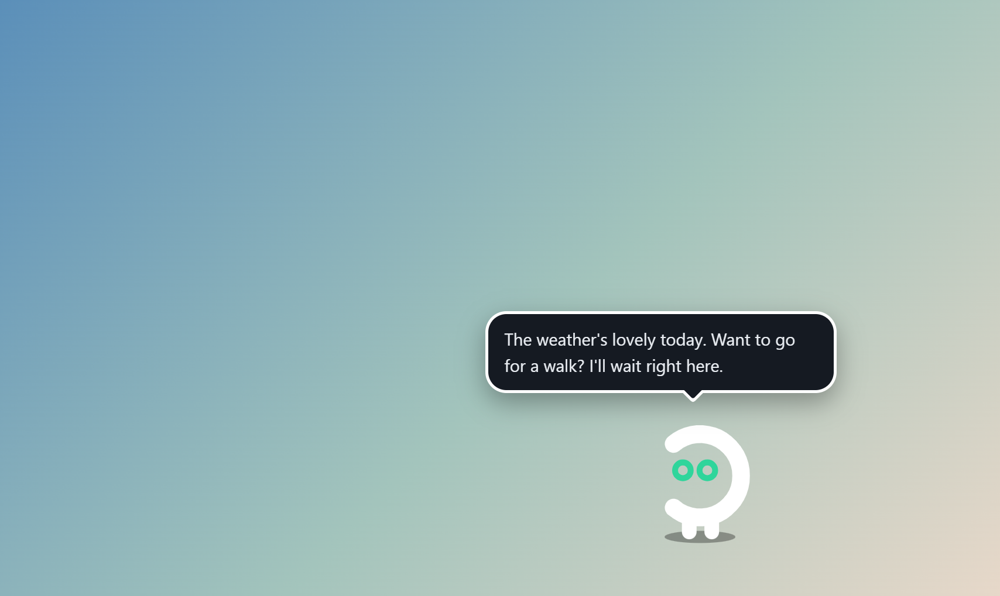
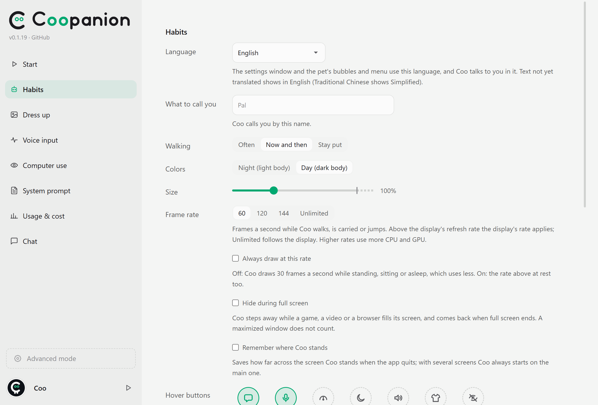
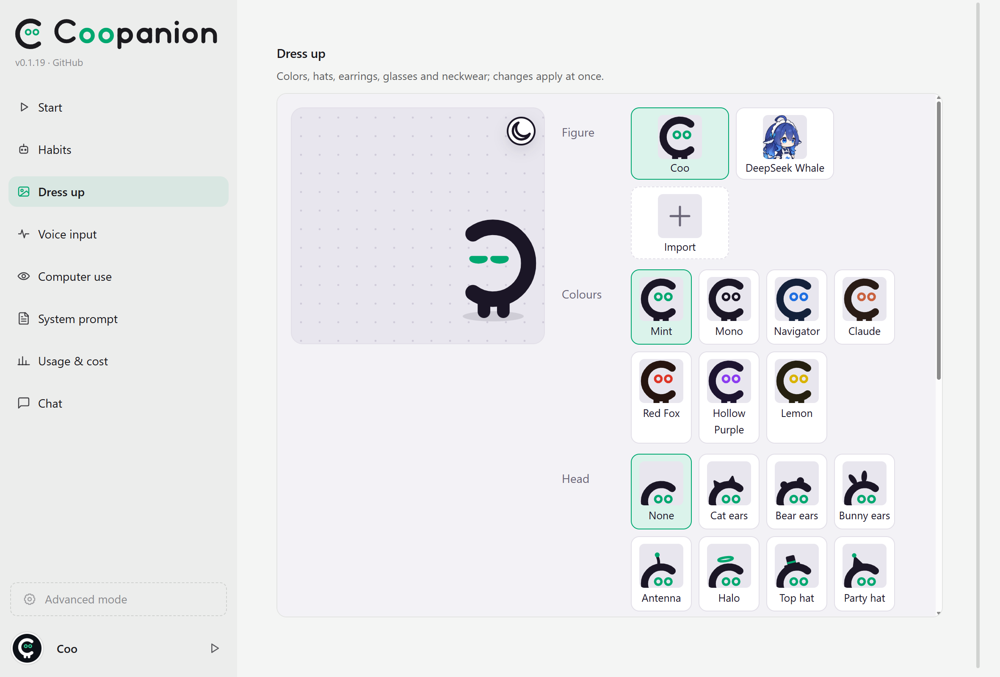
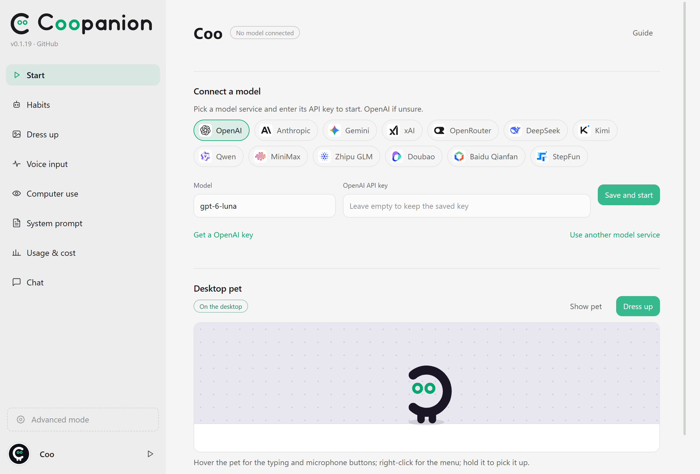

<p align="center">
  <picture>
    <source media="(prefers-color-scheme: dark)" srcset="assets/banner-dark.svg">
    
  </picture>
</p>

<p align="center">
  English ｜
  <a href="README_zh.md">简体中文</a>
</p>

<p align="center">
  <a href="https://github.com/Pal-AI-Lab/Coopanion/releases/latest"></a>
  <a href="https://github.com/Pal-AI-Lab/Coopanion/actions/workflows/ci.yml"></a>
  
  
  
  <a href="LICENSE"></a>
</p>

<p align="center">
  <a href="#install">Install</a> ｜
  <a href="#getting-started">Getting Started</a> ｜
  <a href="#everyday-use">Everyday Use</a> ｜
  <a href="#faq">FAQ</a> ｜
  <a href="https://github.com/Pal-AI-Lab/Coopanion/releases">Changelog</a> ｜
  <a href="docs/DEVELOPMENT.md">Development</a>
</p>

Coopanion is a desktop pet. **Coo** lives on the bottom edge of your screen: it chats with you in speech bubbles, listens when you talk, walks along the edge, and with your permission can use your computer. It runs on Windows, macOS and Linux.

**Languages**: the app and its first-run guide are in 简体中文, 繁體中文, English, 日本語, 한국어, Français, Deutsch, Español (Latinoamérica), Português (Brasil), Italiano and Русский. A new install uses the system language (English when the system language is none of these). Upgrades keep the existing language. Change it under **Language** on the Habits page. Coo talks to you in the app language.


<p align="center"></p>

## Features

- **Many model services**: OpenAI, Anthropic, Gemini, xAI, OpenRouter, DeepSeek, Kimi, Qwen, MiniMax, Zhipu GLM, Doubao, Baidu Qianfan and StepFun. Pick one and paste an API key.
- **Chat**: hold the talk key and speak, or type; Coo answers in a bubble. Speech is recognized on your machine with FunASR or Whisper, picked by the app language.
- **Memory**: Coo remembers what you talked about, and knows when you poke it or pat its head.
- **Computer use**: clicking buttons, typing, switching windows. Coo asks before it acts.
- **Activity bubbles**: see when Coo is thinking and what it is working on, with a different animated icon for reading, searching, writing and using the computer. File names appear; the bubble lets clicks through. On by default; turn it off in Habits.
- **Figures**: Coo, or the **DeepSeek Whale**, a fully animated whale maid with eight vendor color schemes. Other figure packs are imported on the Dress up page from a zip or a folder; packs written for figure API 2 keep loading in later versions (see the [figure pack compatibility promise](packages/cortico-world-desktop-pet/README.md#形象包兼容承诺)).
- **Dress up**: Coo's colors, hats, earrings, glasses and neckwear, plus its size and how often it walks.
- **Extensions**: install Worlds such as a QQ bot, a drawing room and small games from the Extensions page.

What changed in each version is in [Releases](https://github.com/Pal-AI-Lab/Coopanion/releases).

## Install

You need one of:

- Windows 10 / 11 (64-bit)
- macOS 13 or later (Apple silicon or Intel)
- A 64-bit Linux desktop (X11, or XWayland under Wayland); speech recognition needs glibc 2.32 or later (Ubuntu 22.04, Debian 12 and later)

You also need an API key from one model service, which bills you for usage (see [Cost and privacy](#cost-and-privacy)). The guide lists DeepSeek first when the app language is Simplified Chinese and OpenAI first in every other language. Installing does not need administrator rights.

### Windows: installer

1. Open the [latest release](https://github.com/Pal-AI-Lab/Coopanion/releases/latest) and download `Coopanion-Setup-<version>.exe`.
2. Run it; its pages follow the system language. The installer is not code-signed, so Windows may show "Windows protected your PC": click **More info** → **Run anyway**.
3. Pick a folder (default `C:\Users\<you>\Coopanion`) and install. Coopanion starts when done, and a desktop icon is added.

> [!NOTE]
> The program and all its data stay in the install folder and nothing goes to AppData, so it has no Start menu entry. Open it from the desktop icon.

### Windows: one command

Open PowerShell, paste this line and press Enter:

```powershell
irm https://raw.githubusercontent.com/Pal-AI-Lab/Coopanion/main/installer/install.ps1 | iex
```

It downloads the latest installer, runs it, and deletes the download afterwards.

### macOS

1. Open the [latest release](https://github.com/Pal-AI-Lab/Coopanion/releases/latest). On Apple silicon download `Coopanion-<version>-mac-arm64.dmg`; on Intel download `…-mac-x64.dmg`.
   Not sure which you have: Apple menu → About This Mac. If "Chip" says Apple M-something, it is Apple silicon.
2. Open the dmg and drag Coopanion into Applications.
3. The app has no Apple developer signature, so macOS blocks the first open. Open it once and click Done on the warning, then go to System Settings → Privacy & Security, click **Open Anyway** at the bottom and confirm with your password. It opens normally after that.
4. Coopanion lives in the menu bar at the top of the screen. It shows in the Dock only while the settings window is open.

> [!NOTE]
> Data is in `~/Library/Application Support/Coopanion`. macOS asks separately for Microphone (voice input), Input Monitoring (talk key), and Screen & System Audio Recording plus Accessibility (computer use) the first time each is needed. To keep Coo off your computer, deny the last two. Restart Coopanion after changing Input Monitoring, Accessibility or Screen Recording. The app is not signed with an Apple Developer ID, so macOS does not carry these grants over to an updated version: if Coopanion says a permission is missing while its switch is on, remove Coopanion from that list with −, add `/Applications/Coopanion.app` back and restart.

### Linux

1. Open the [latest release](https://github.com/Pal-AI-Lab/Coopanion/releases/latest) and download `Coopanion-<version>-linux-x64.deb` (Debian / Ubuntu) or `Coopanion-<version>-linux-x64.AppImage` (other distributions).
2. deb: `sudo apt install ./Coopanion-<version>-linux-x64.deb`, then open Coopanion from the app menu.
   AppImage: `chmod +x Coopanion-*.AppImage` and run it. Ubuntu 22.04 and later need `libfuse2` first (`sudo apt install libfuse2t64`).
3. The pet is a transparent always-on-top window, so the desktop needs compositing (on by default in GNOME and KDE). Under Wayland it runs through XWayland.

> [!NOTE]
> Data is in `~/.config/Coopanion`. The tray icon needs status icon support (GNOME needs the AppIndicator extension); without a tray, right-click Coo to reach the settings.
> Computer use needs `xdotool` and `zenity`, which the deb installs. Screenshots under Wayland also need one of `grim`, `spectacle`, `scrot` or ImageMagick.

## Getting started

1. **Start**: Coo drops to the bottom of the screen and an icon appears in the tray (menu bar on Mac, status bar on Linux). No window opens.
2. **Guide**: on first start Coo walks you through setup in its bubbles; you pick or type the answers right there:
   1. what Coo should call you, and where you heard about Coopanion ("I'd rather not say" is one of the answers; the answer is sent with the anonymous usage statistics when they are on);
   2. how much it walks around: stay put / now and then / often;
   3. which model service to use (the first one listed if unsure), then paste the API key and test the connection;
   4. download the speech model (FunASR, about 230 MB; Whisper, about 360 MB, when the app language is French, German, Spanish, Portuguese, Italian or Russian; from ModelScope), then how to talk to Coo;
   5. where the buttons, menu and settings are, and that the persona is on the System prompt page of the settings window.

   After the guide you can talk Coo through its personality, way of speaking and what you call each other; it can write the persona into its prompt itself.

   Coo's persona and prompts are written in Chinese when the app language is Simplified or Traditional Chinese and in English for every other language; for languages other than Simplified Chinese and English, Coo is also told to talk to you in the app language. Changing the language swaps the starting persona for the other version as long as you have not edited it; Coo reads it from its next session. An edited persona stays as it is.

   The × at the top right of the bubble ends the guide at any time. Run it again from **Guide** on the Start page. If you chose to enter the key later, Coo asks again after a while, and each time you talk to it before a model is connected it offers to connect one.
3. **Say hello**: tap **Left Alt** (**Left Option** on Mac), then press and hold it, say "hello", and release to send. Allow microphone access when asked.

<details>
<summary><b>Getting an API key</b></summary>

For DeepSeek:

1. Open the [DeepSeek platform](https://platform.deepseek.com/api_keys), sign up and log in;
2. Top up your balance (billed by usage);
3. API Keys → Create API key, copy the string that starts with `sk-`, and paste it into Coo's bubble or the Start page.

For the others, select the service in the bubble or on the Start page and use its "get a key" link. The table is in the order the app lists services for languages other than Simplified Chinese:

| Service                               | Get a key                                                                                                                                                                                  | Default model                                                                     |
| ------------------------------------- | ------------------------------------------------------------------------------------------------------------------------------------------------------------------------------------------ | --------------------------------------------------------------------------------- |
| OpenAI                                | [platform.openai.com](https://platform.openai.com/settings/organization/api-keys)                                                                                                          | `gpt-6-luna`                                                                      |
| Anthropic                             | [platform.claude.com](https://platform.claude.com/settings/keys)                                                                                                                           | `claude-haiku-5-5`                                                                |
| Gemini (Google AI Studio)             | [aistudio.google.com](https://aistudio.google.com/apikey)                                                                                                                                  | `gemini-3.5-flash-lite`                                                           |
| xAI                                   | [console.x.ai](https://console.x.ai/team/default/api-keys)                                                                                                                                 | `grok-4.3`                                                                        |
| OpenRouter                            | [openrouter.ai](https://openrouter.ai/settings/keys)                                                                                                                                       | `deepseek/deepseek-v4.1-flash`                                                    |
| DeepSeek                              | [platform.deepseek.com](https://platform.deepseek.com/api_keys)                                                                                                                            | `deepseek-flash`                                                                  |
| Kimi (Moonshot)                       | international [platform.kimi.ai](https://platform.kimi.ai/console/api-keys), mainland China [platform.kimi.com](https://platform.kimi.com/console/api-keys)                                 | `kimi-k3`                                                                         |
| Qwen (Alibaba Cloud Model Studio)     | international [modelstudio.console.alibabacloud.com](https://modelstudio.console.alibabacloud.com/ap-southeast-1/model/settings/api-key), mainland China [bailian.console.aliyun.com](https://bailian.console.aliyun.com/cn-beijing/model/settings/api-key) | `qwen3.8-flash`                                                                   |
| MiniMax                               | international [platform.minimax.io](https://platform.minimax.io/user-center/basic-information/interface-key), mainland China [platform.minimax.cn](https://platform.minimax.cn/user-center/basic-information/interface-key) | `MiniMax-M3`                                                                      |
| Zhipu GLM                             | international (Z.ai) [z.ai](https://z.ai/manage-apikey/apikey-list), mainland China [bigmodel.cn](https://bigmodel.cn/usercenter/proj-mgmt/apikeys)                                        | `glm-5.3-flash` (on the mainland China platform, switch to `glm-5.3` if it fails to connect) |
| Doubao (Volcengine Ark)               | [ark.volcengine.com](https://ark.volcengine.com/region:cn-beijing/apikey)                                                                                                                  | `doubao-seed-2-1-lite-260915` (enable it in the Ark console first)                |
| Baidu Qianfan                         | [console.bce.baidu.com](https://console.bce.baidu.com/iam/#/iam/apikey/list)                                                                                                               | `glm-5.3-flash`                                                                   |
| StepFun                               | [platform.stepfun.com](https://platform.stepfun.com/interface-key)                                                                                                                         | `step-3.7-flash`                                                                  |

Each default is the fast, cheap, vision-capable tier of that vendor. To use another model, change the name in the guide or in the Model field on the Start page.

Kimi, Qwen, MiniMax and Zhipu GLM have separate mainland China and international platforms, with separate accounts and keys. New connections use the mainland China platform when the app language is Simplified Chinese and the international one otherwise; switch between them on the Start page. Doubao, Baidu Qianfan and StepFun take mainland China accounts only and appear under **More** in other languages.

Only DeepSeek and Anthropic have been tested with real keys; the others follow their documentation. Open an issue if one fails.

</details>

## Everyday use

### Talking to Coo

| How           | What to do                                                                                                                            |
| ------------- | ------------------------------------------------------------------------------------------------------------------------------------- |
| Voice         | **Tap Left Alt, then press and hold it** (Left Option on Mac) and speak; releasing ends the sentence. Recognized text shows in a dashed bubble. |
| Typing        | Rest the pointer on Coo and click the bubble button beside it. With "Double-click Coo to open the typing box" on in Habits, double-clicking works too. |
| Mic button    | Appears when the pointer rests on Coo and turns voice input on or off. Its corner shows the talk key (`ALT×2` by default) while listening on the key, AUTO while always listening. Long-press it while listening to send the sentence at once. |
| Answering     | When Coo offers choices, click one or press 1–3; if none fits, write your own in the last box.                                         |

Talk key, microphone and listening mode (hold to talk / press to toggle / always listen) are on the Voice input page. Click the talk key button and press a single key, a combination such as `Ctrl + Space`, or a mouse side button; beside it, choose **Double-tap, then hold** (the default) or **Just hold**. When the talk key is unavailable, Coo falls back to always listening and the button shows AUTO.

Speech is recognized on your machine and audio is never uploaded: by **FunASR** (the SenseVoiceSmall model, about 230 MB) when the app language is Chinese, English, Japanese or Korean, and by **Whisper** (the small model, about 360 MB; the text appears once a sentence ends) for French, German, Spanish, Portuguese, Italian and Russian. The model is downloaded once, from the guide or the Voice input page. On Windows you can use the built-in recognizer instead, which needs no download but is less accurate.

### Playing with Coo

- **Click** to poke it, **move back and forth over its head** to pat it, **press and drag** to pick it up; let go mid-swing to throw it. By default a poke makes Coo respond, and pats and pick-ups are passed on the next time it wakes. **Response mode** in Habits changes this: Quiet keeps every touch until you next talk to Coo, Eager responds to every touch, Custom… picks the touches that get a response right away.
- **Expressions and motions**: Coo pairs what it says with a face and a motion. Faces: happy, wink, love, shy, surprised, angry, sad, sleepy, thinking, smug, pout, worried, determined, flustered, scared, excited (starry eyes), crying, confused. Motions include nod, shake, look around, turn, spin, jump, sit, sleep, wave, bow, shiver, flap, dance. As the DeepSeek Whale, a nod really dips the head and a shake turns the face, a wave raises the arm nearer you, and a bow tips the upper body forward.
- **Right-click** for the menu: pause / resume, settings, quit, plus typing, voice input, walking, night mode, sounds, dress up and hide.
- **Hover buttons**: the buttons beside Coo while the pointer rests on it. Typing and voice by default; pick up to six in Habits.
- **Remember where Coo stands**: turn it on in Habits and Coo returns to the same spot across the screen on the next start.
- **Several displays**: Coo starts on the main display. Carry it to another display and let go to move it there. If that display is unplugged, Coo returns to the main one.

### Letting Coo use your computer

Computer use is on by default. Coo looks at the screen without asking, and asks before it first uses the mouse and keyboard; after you say yes it does not ask again for 30 minutes. Installs from before this default keep asking every turn.

- Change this under **When to ask you** in the Computer use section of the Habits page, from strictest to loosest:
  - `ask-each-turn`: ask every turn;
  - `ask-before-acting`: looking is not asked; ask every turn before using the mouse and keyboard;
  - `ask-once` (default): looking is not asked; ask once before acting, then not again for the time set in **A yes lasts** (30 minutes by default);
  - `never-ask`: never ask.
- When you touch the mouse or keyboard, Coo stops and waits for you.
- Logins, passwords and payments are left to you.
- One wake makes at most 40 model requests; at the limit the turn ends and you can tell Coo to continue. The limit is on the Cormini page in advanced mode and applies after a restart.

To keep Coo off your computer, untick **Let Coo use this computer** in the Computer use section of the Habits page.

### Tray / menu bar

Coopanion keeps running in the background. Closing the settings window does not quit it, and opening the program again only brings Coo back.

The tray icon (menu bar on Mac, status bar on Linux) has a menu to open the settings, show the pet, start at login, restart and quit. On Windows, left-clicking the icon opens the settings.

## Settings window

Click the tray icon, or right-click Coo and click the gear. The window opens in **normal mode**, which shows only the pages about the pet:

| Page          | What is there                                                                                                    |
| ------------- | ---------------------------------------------------------------------------------------------------------------- |
| Start         | Connect a model (the connected one and the other providers in one place), show or hide the pet on the desktop, preview the pet, pick a color scheme or edit its palette, rerun the guide. The bottom left says Running / Paused, beside pause / resume and shut down. |
| Habits        | In sections: General (app language, your name, anonymous usage statistics), Behavior (walking, how Coo responds, what Coo may change by itself, hover buttons, double-click to type, status bubble), Display (size, frame rate, hide in full screen on Windows, remember position), Sounds (each kind can be turned off), Computer use (on/off, mouse and keyboard, when to ask you, how long a yes lasts) |
| Dress up      | Figure (Coo, the DeepSeek Whale or an installed figure pack), colors and accessories; changes apply at once. **Import** at the end of the figure row installs packs from a zip or a folder (up to 128 MB at a time); dropping one on the page works too |
| Voice input   | On/off, recognizer, model download, talk key, microphone, listening mode                                          |
| System prompt | Coo's system prompt; the persona is the CONSTITUTION section. Save with Ctrl+S and apply with **Reload current session**; **Clear and restart** drops the current conversation |
| Usage & cost  | Tokens used and money spent per day                                                                               |
| Chat          | The current conversation; you can also talk to Coo from here                                                      |

<p align="center"></p>
<p align="center"></p>

The current version is shown at the top left, with a download link below it when a newer release is out. The Windows build and the AppImage download new versions in the background; Coo then asks in its bubble whether to restart and update, or the update installs the next time you quit. If a download stalls, get it from GitHub yourself. On Mac and with the deb, download new versions by hand. After an update, Coo tells you what the new version brings; when you change what it calls you, its dress, walking, computer use or similar settings here, it hears about it and responds.

**Advanced mode** at the bottom left shows every page (Worlds, models, extensions, memory, diagnostics); **Back to normal mode** hides them again.

### Changing the model

Under **Connect a model** on the Start page, pick a service, fill in the model name (a default is filled in) and the key. Each service, and each platform of a service with two, keeps its own key, so switching back needs no re-entry.

<p align="center"></p>

The default is the first service listed for the app language at install time: DeepSeek's `deepseek-flash` in Simplified Chinese, OpenAI's `gpt-6-luna` otherwise. Computer use needs a model that can read images; every service's default can. Each platform is called through the API its documentation describes: Anthropic through the Messages API, Gemini through the Gemini API, Baidu Qianfan and Zhipu's international platform Z.ai through Chat Completions, the rest through the Responses API. The Model page in advanced mode also lets you:

- change the model and the reasoning effort;
- add an "OpenAI Responses Compatible" connection for any other service that speaks the Responses API;
- enter prices for services other than DeepSeek, OpenAI, Anthropic, Gemini and xAI so Usage & cost can show spending.

### Installing extensions

The Extensions page in advanced mode lists Worlds on npm with the `cortico-world` keyword, for example:

- QQ bot (`cortico-world-qq-better`)
- Drawing room and Pictionary (`cortico-world-canvas`)
- Plants vs. Zombies (`cortico-world-pvz`)
- Slay the Spire (`cortico-world-sts-1`)

After installing, click **Restart process** and enable it in **World Overview**. Reinstalling the app keeps your extensions.

## Cost and privacy

- **Cost**: Coopanion is free. The model service you choose bills you for usage; see the Usage & cost page (built-in prices exist for DeepSeek, OpenAI, Anthropic, Gemini's paid tier and xAI).
- **Sent to the model service**: what you say and type, your interactions with Coo, and screenshots during computer use. Only the service you configured receives them.
- **Kept on your machine**: API keys, memory, conversation history, settings and logs. Speech is recognized locally and only the text is sent.
- **Anonymous usage statistics**: sent to `survey.palailab.org`. Only counts, time used, settings and a random install ID; no conversations, screenshots, keys or files. Every field is listed in [docs/TELEMETRY.md](docs/TELEMETRY.md). Turn it off in Habits.
- **Other network access**: a check for new releases on GitHub when the settings window opens; npm when installing extensions; ModelScope (or Hugging Face as a fallback) when downloading the speech model.

## Data and uninstalling

| System  | Data folder                               | Uninstall                                                   |
| ------- | ----------------------------------------- | ----------------------------------------------------------- |
| Windows | `data` inside the install folder          | Settings → Apps                                             |
| macOS   | `~/Library/Application Support/Coopanion` | Drag Coopanion from Applications to the Trash               |
| Linux   | `~/.config/Coopanion`                     | deb: `sudo apt remove coopanion`; AppImage: delete the file |

Uninstalling keeps the data, so memory and settings are still there after a reinstall. To remove everything, delete the data folder by hand (on Windows, the whole install folder).

Inside the data folder, `home` holds memory, conversations, settings and API keys, `extensions` the extensions, `logs` the logs, and `home/models` the speech model.

## FAQ

<details>
<summary><b>The pet is gone</b></summary>

Right-click the tray icon → Show pet. If the tray icon is hidden, click `^` at the bottom right of the taskbar. Opening the program again also works. On Mac, click the menu bar icon → Show pet.

</details>

<details>
<summary><b>Coo does not answer</b></summary>

Check the status next to the title on the Start page:

- **No model connected**: check that the API key is complete and the account has balance, then click **Test**. For Kimi, Qwen, MiniMax and Zhipu GLM, the key only works on the platform (mainland China or international) it was created on. Doubao needs the default model enabled in the Ark console first.
- **Paused**: click resume at the bottom of the left bar.

After 5 failed model requests in a row, Coo says the error in a bubble (unknown model name, invalid key, no balance, …); click **Open settings** to fix it.

</details>

<details>
<summary><b>Coo cannot hear me</b></summary>

- Check that the mic button beside Coo is not crossed out;
- Tap Left Alt first, then press and hold it (two presses too far apart do not count);
- The Voice input page shows the recognizer as ready; if the model is missing, click Download. The level meter moves while you speak;
- Windows: Settings → Privacy & security → Microphone, allow desktop apps to use the microphone;
- Mac: in System Settings → Privacy & Security, turn on Microphone and Input Monitoring for Coopanion, then restart it.

If the Windows recognizer reports no speech recognizer, install speech recognition for the app language under Settings → Time & language → Language, or switch back to FunASR or Whisper.

</details>

<details>
<summary><b>I need a proxy</b></summary>

Set `HTTP_PROXY` / `HTTPS_PROXY` in the environment Coopanion starts from. Local traffic bypasses the proxy. See the [development guide](docs/DEVELOPMENT.md).

</details>

<details>
<summary><b>What is it thinking?</b></summary>

The Chat page has the full record. If something goes wrong, click **Export diagnostics** there and attach the file to an [issue](https://github.com/Pal-AI-Lab/Coopanion/issues).

</details>

## Feedback and contributing

- Report problems and ideas in [Issues](https://github.com/Pal-AI-Lab/Coopanion/issues) with your OS version, Coopanion version and steps to reproduce.
- To build from source or change the code, see the [development guide](docs/DEVELOPMENT.md).

## Acknowledgements

Coopanion is assembled from [Cortico](https://github.com/Pal-AI-Lab/Cortico): Cortico Core + Cormini Persona + the [desktop pet World](packages/cortico-world-desktop-pet) + the [computer use World](packages/cortico-world-cua).

## License

[AGPL-3.0-or-later](LICENSE). Releases up to and including 0.1.10 are MIT. The Cortico framework is MIT and ships as a submodule. To open a PR see [CONTRIBUTING.md](CONTRIBUTING.md); your first contribution needs a signed [Contributor License Agreement](CLA.md).

The DeepSeek Whale artwork (the textures under `packages/cortico-world-desktop-pet/web/whale/`) is not covered by the AGPL; its origin and the vendor logos are described in the [desktop pet World's third-party notices](packages/cortico-world-desktop-pet/THIRD_PARTY_NOTICES.md). Third-party components shipped or downloaded at runtime: Electron (MIT), Cortico (MIT), sherpa-onnx (Apache-2.0), FunASR's SenseVoiceSmall model ([FunASR model license](https://github.com/modelscope/FunASR/blob/main/MODEL_LICENSE), downloaded on use), OpenAI's Whisper small model (MIT, downloaded on use), koffi (MIT), jpeg-js (BSD-3-Clause), pnpm (MIT); model service logos come from [lobe-icons](https://github.com/lobehub/lobe-icons) (MIT; each logo belongs to its company and only identifies the service).
